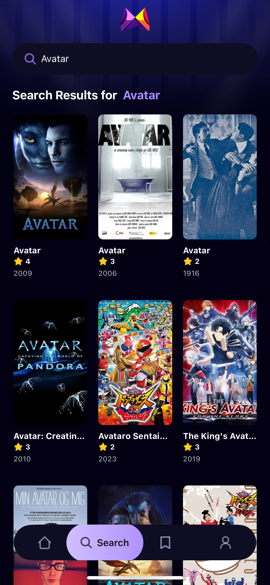
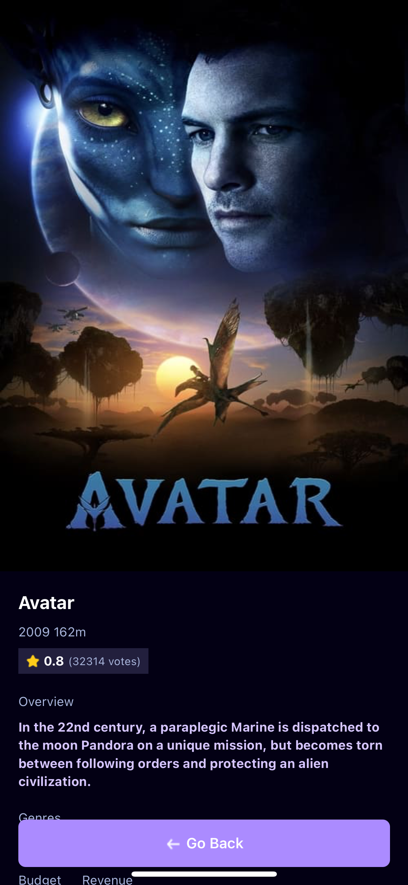
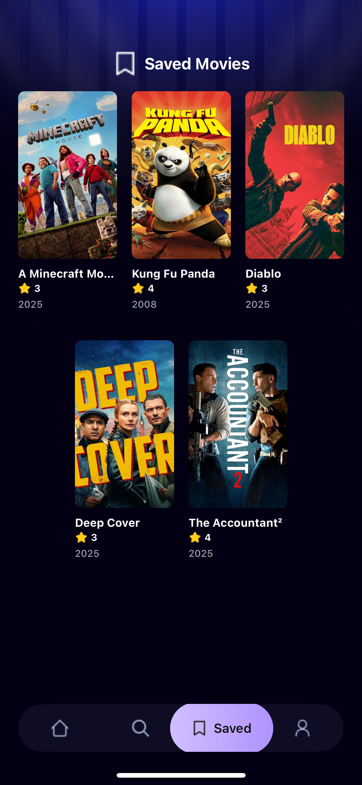

# 🎬 MovieFlix – React Native Movie Explorer App

MovieFlix is a beautifully designed mobile application built using React Native and Expo, inspired by the Netflix experience. It fetches and displays **trending**, and **latest** movies in an interactive card-based layout. Users can tap a movie to view detailed information including its title, synopsis, release date, and IMDb rating. You can also **save** your favorite movies for easy access later.

---

## 📱 Screenshots

| Home Screen | Search Screen | Movie Details Screen | Saved Movies Screen |
|-------------|----------------|------------------------|----------------------|
|  |  |  |  |

---

## 🚀 Features

- 🎥 **Browse Movies** – Scrollable cards with posters and movie titles
- 🔍 **Search Functionality** – Instantly search for movies using a custom search bar
- 💾 **Saved Movies** – Bookmark your favorite movies and access them anytime from the Saved screen
- 📖 **Movie Details View** – See full movie information including IMDb rating
- 💅 **Modern UI** – Styled with Tailwind CSS using NativeWind, optimized for dark mode
- 📡 **API Integration** – Fetches live movie data using The Movie Database (TMDb) API

---

## 🛠️ Built With

- [React Native](https://reactnative.dev/)
- [Expo](https://expo.dev/)
- [NativeWind](https://www.nativewind.dev/)
- [TMDb API](https://developer.themoviedb.org/)
- [TypeScript](https://www.typescriptlang.org/)
- [Appwrite](https://appwrite.io/) – for backend and database operations

---

## 📂 Folder Structure

```bash
mobile_movie_app/
├── app/                  # Screens & routes (Expo Router)
├── components/           # Reusable UI components (e.g., SearchBar, MovieCard)
├── constants/            # Icons, images, and color definitions
├── services/             # API functions, Appwrite client, and custom hooks
├── assets/               # Fonts, screenshots, static images
│   └── screenshots/      # Home, Search, Details, and Saved screen captures
├── tailwind.config.js    # Tailwind/NativeWind configuration
├── App.tsx               # App entry point
└── ...
